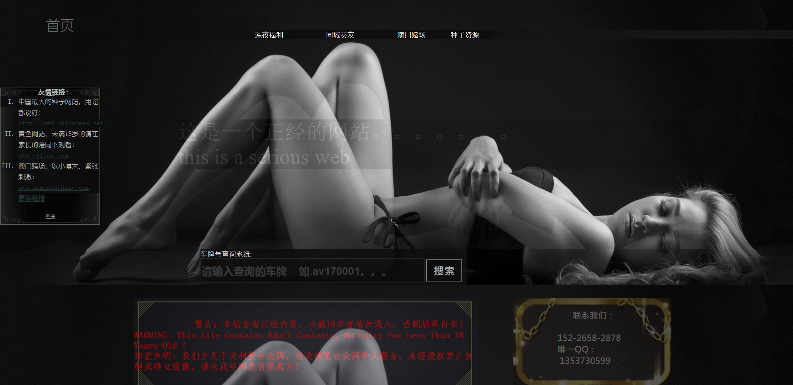
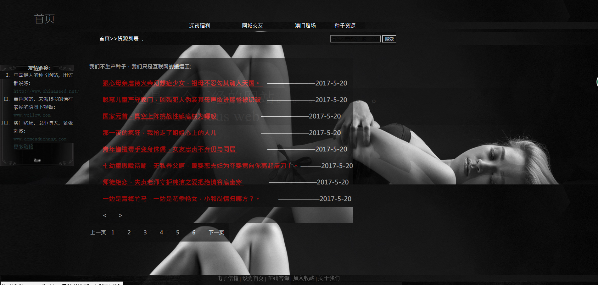

# 一个正经的网站
2016011480
-4班
-卓必成

**设计目的**：
 
- **1** ：熟练掌握HTML在组织结构上的优势。
- **2** ：熟练掌握CSS在网页布局中的应用。
- **3** ：学习Web标准及浏览器的兼容性。

-------------------

### 功能性需求分析

> 该网站共有3个页面，其中每一个页面的屏幕截图及主要功能如下所列。

（1）	首页：

屏幕截图：

>主要实现功能：首页导航栏功能：……  首页…… 

（2）	二级页面：

（3）	三级页面：

（4）	其他页面

2.	搜集素材网站：www.baidu.com

3.	建立网站代码目录结构:  index.html->list.html->content.html

### 代码块
首页部分

<!DOCTYPE html>
<html>
<head>
	<title>一个正经的网站</title>
	<meta charset="utf-8">
	<link rel="stylesheet" type="text/css" href="style.css">
</head>
<body>

		

	
		

			<	
			<table>
				<tr>
				<td width="500px;" id="shouye">
						首页
			
				</tr>
			</table>
				

		

		

				

			
				<a href="content.html">&nbsp; &nbsp; 	&nbsp; &nbsp;深夜福利&nbsp; &nbsp; 	&nbsp; &nbsp;</a>
				

				

				<a href="list.html">&nbsp; &nbsp; 	&nbsp; &nbsp;同城交友&nbsp; &nbsp; 	&nbsp; &nbsp;</a>
				

				

				<a href="list.html">&nbsp; &nbsp; 	&nbsp; &nbsp;澳门赌场&nbsp; &nbsp; 	&nbsp; &nbsp;</a>
				

				

				<a href="list.html">&nbsp; &nbsp; 	&nbsp; &nbsp;种子资源&nbsp; &nbsp; 	&nbsp; &nbsp;</a>
				

			

				

				

				

					
 这是一个正经的网站。。。。。。。
					 
					this is a serious web	
					

					

				

				

		&nbsp; &nbsp; &nbsp;&nbsp; &nbsp; &nbsp;<strong>友情链接：</strong> 
		<ul>
		<li> 中国最大的种子网站，用过都说好:
			<a href="http://www.chinaseed.net/">http://www.chinaseed.net/</a>	
		</li>
		<li> 黄色网站，未满18岁的请在家长的陪同下观看:
			<a href="yellow.html">www.yellow.com</a>
		</li>
		<li> 
		澳门赌场，以小博大，紧张刺激:
		<a href="http://hlddz.qq.com/webplat/info/news_version3/11981/11982/12588/m9679/201508/371936.shtml">www.aomenduchang.com</a>
		</li>
		 <a id="zz" href="">   更多链接</a>
		</ul>
     
		

	

	
 车牌号查询系统:

		<form>
		<input type="text" value="请输入查询的车牌    如.av170001。。。" id="text">
		<input type="submit" name="搜索" id="submit" value="搜索">
		</form>

		

			

			

			
		  
			
			&nbsp;	&nbsp;	&nbsp;&nbsp;	&nbsp;	&nbsp;	&nbsp;&nbsp;警告：本站含有正经内容，未满18岁者请勿进入，否则后果自负！ 

        WARNING: This Site Contains Adult Contents, No Entry For Less Than 18-Years-Old !  

郑重声明：我们立足于美利坚合众国，对美利坚合众国华人服务，未经授权禁止复制或建立镜像，请未成年网友自觉离开！
		
				
			

		

			 
			&nbsp;	&nbsp;	&nbsp;	&nbsp;	&nbsp;&nbsp;	&nbsp;	&nbsp;	&nbsp;&nbsp;&nbsp;	&nbsp;	&nbsp;&nbsp;	&nbsp;	&nbsp;		联系我们：
			 
			
			
		
				 
					&nbsp;	&nbsp;&nbsp;	&nbsp;	&nbsp;	&nbsp;&nbsp;&nbsp;	&nbsp;	&nbsp;&nbsp;	&nbsp;	&nbsp152-2658-2878
				 
					&nbsp;	&nbsp;&nbsp;	&nbsp;	&nbsp;	&nbsp;&nbsp;&nbsp;	&nbsp;	&nbsp;&nbsp;	&nbsp;	&nbsp唯一QQ：
			 	&nbsp;	&nbsp;&nbsp;	&nbsp;	&nbsp;	&nbsp;&nbsp;&nbsp;	&nbsp;	&nbsp;&nbsp;	&nbsp;	&nbsp 1353730599

			

			

			

	&nbsp;	&nbsp;	&nbsp;&nbsp;&nbsp;	&nbsp;	&nbsp;&nbsp;&nbsp;	&nbsp;	&nbsp;&nbsp;&nbsp;	&nbsp;	&nbsp;&nbsp;	&nbsp;	&nbsp;<strong>电子信箱&nbsp|&nbsp设为首页&nbsp|&nbsp在线答询&nbsp|&nbsp加入收藏&nbsp|&nbsp关于我们 <strong> 
	____________________________________________________________________________________
	
 
	
copyright@2016 &nbsp  &nbsp suprise &nbsp  mother &nbsp  &nbsp fucker  &nbsp  &nbspget your &nbsp  &nbsp ass
back here 
冀望公安网厅备av100097号
	

			

			
	

		
	

		

		

		

		

		

		

</body>
</html>
二级页面

	<!DOCTYPE html>
	<html>
	<head>
	<title>这是一个正经的网站</title>
	<meta charset="utf-8">
	<link rel="stylesheet" type="text/css" href="css/list.css">
	</head>
	<body>
		<!--页头部分-->
		

		

		<!--页面主体部分部分-->
		

		

		<!--页脚部分-->
		

	    

	</body>
	</html>
	
5.	编写CSS布局及样式
（1）	CSS布局：
>核心技术：

> Float实现布局：Position辅助布局：

----------

    body{
    background-image: url(../images/bodybg.jpg);
    font-size: 18px;
    color: #bebebe;
    font-family: '宋体';
    border-style: none;
    list-style-type:none;
    background-size: cover;
    background-repeat: repeat-y;
	}
（2）	添加CSS样式：
>通用类属性：

----------

    *{{margin:0px;
		border:0px;
   
	}	
6.	调试浏览器兼容性
（1）	问题1：

>在Chrome中的表现（屏幕截图）：

### 问题记录
1.问题表现：相对定位不准，需要自己细心校正位置。
2.问题表现：链接与列表的style设置

### 设计总结
1.需求分析阶段的经验：要考虑面向对象，受众是哪类人群，从而选择合适的界面风格
2.编写HTML代码的经验：先打出一套完整的主体代码，再逐层的进行填充细化，从而可以使得结构清晰明朗。

3.CSS布局的经验：按照一定顺序进行编写，一个网站的页面基本页头页脚是固定的，可以统一设置页头页脚css样式

4.设置CSS样式经验：可先从div的基本设置如长宽、边框、背景，然后是字体风格、

5.调整浏览器兼容性经验：尽量写通用语言，语言标准规范，编写完成后可用验证网站检验

6.Sublime Text使用经验：sublime非常智能，可以自动补充双标签或者检索可能会用到的可用项，但在学习初期应该依靠自己将代码编写出来，尽量少依赖编辑器。

### 课程小结

1.网上参考的内容：设置照片墙的方法

2.浏览器对CSS的兼容性上的不同表现（你所遇到的）：火狐与其他浏览器相比，对于postion的相对定位有一定差别。

